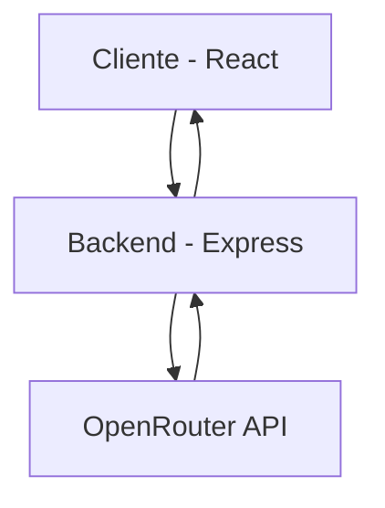

# Padrões de Sistema - JumboIA

## Arquitetura Geral
O JumboIA adota uma arquitetura cliente-servidor típica, com clara separação entre frontend e backend:

## Componentes Principais

### Frontend
- **Interface de Chat**: Componente principal que gerencia a exibição de mensagens
- **Campo de Entrada**: Componente para digitação de mensagens com contador de caracteres
- **Indicador de Digitação**: Elemento visual que indica quando a IA está processando
- **Histórico de Mensagens**: Componente que mantém e exibe o histórico da conversa

### Backend
- **Servidor Express**: Gerencia as requisições HTTP e respostas
- **Middleware de CORS**: Permite comunicação segura entre frontend e backend
- **Middleware de Log**: Registra atividades e erros no servidor
- **Rota de Chat**: Endpoint que processa as requisições de chat e se comunica com a OpenRouter API

## Fluxo de Dados

1. **Entrada do Usuário**:
   - Usuário digita mensagem no frontend
   - Frontend valida e formata a entrada

2. **Processamento**:
   - Frontend envia requisição ao backend
   - Backend prepara o prompt com contexto adequado
   - Backend envia requisição para OpenRouter API
   - OpenRouter retorna resposta gerada pelo modelo

3. **Resposta**:
   - Backend processa e retorna a resposta para o frontend
   - Frontend exibe a resposta na interface de chat

## Padrões de Design

### Frontend
- **Component-Based Architecture**: Componentes React reutilizáveis
- **State Management**: Gerenciamento de estado usando React Hooks
- **Responsive Design**: Layout adaptável usando TailwindCSS
- **Loading States**: Feedback visual durante operações assíncronas

### Backend
- **RESTful API**: Padrões REST para comunicação
- **Middleware Pattern**: Uso de middlewares para funcionalidades transversais
- **Environment Configuration**: Configuração baseada em variáveis de ambiente
- **Error Handling**: Tratamento centralizado de erros

## Decisões Técnicas Importantes
- Uso de TypeScript para tipagem estática e melhor desenvolvimento
- TailwindCSS para estilização rápida e consistente
- Vite como bundler para desenvolvimento mais rápido
- Express para servidor leve e eficiente
- Vercel e Railway para deploy simplificado 